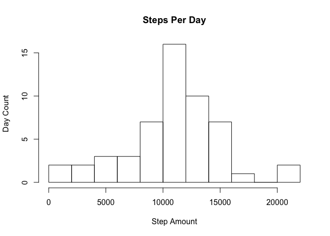
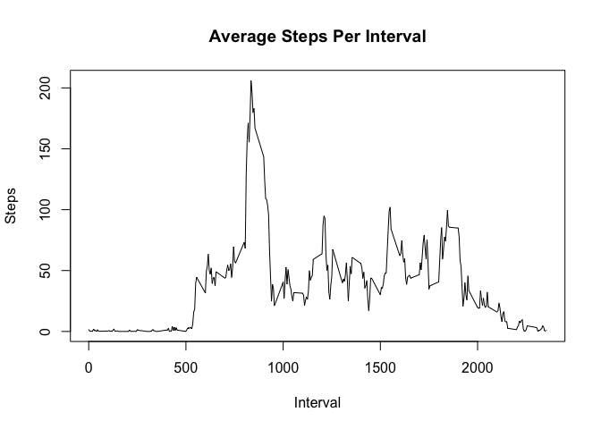
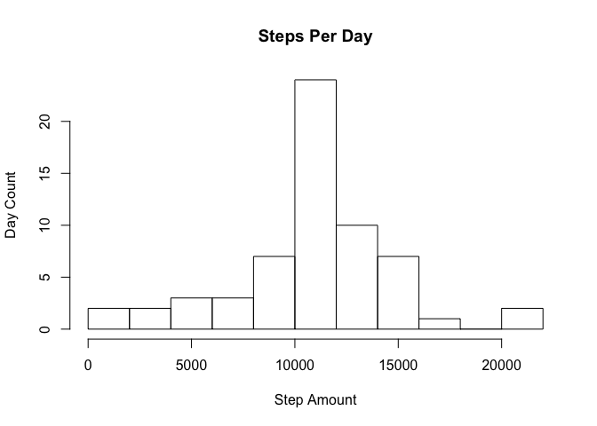
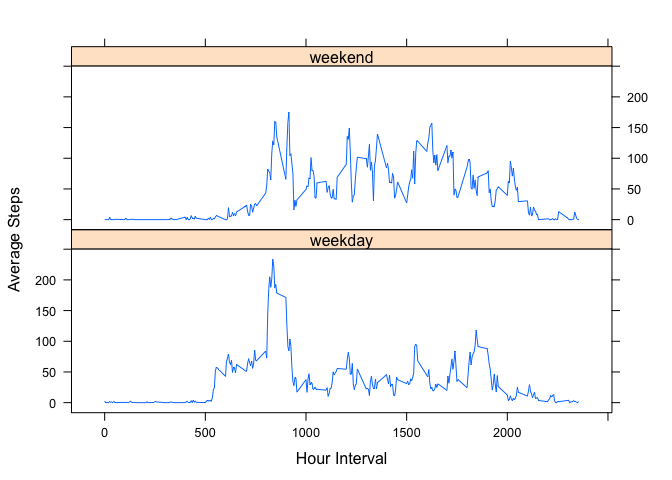

# Peer Assesment 1
###### Patrick McLaughlin 07/17/2015


#####  This script answers the questions detailed in the Peer Assesment 1

## Loading and preprocessing the data

- Load the activity.csv into the dataset dataframe


```r
dataset <- read.csv('activity.csv')
```

## What is mean total number of steps taken per day?
- Remove NA records 
- Calculate the total steps per day
- Plot in a histogram
- Calculate the mean and median steps per day


```r
library(plyr)

completeds <- dataset[complete.cases(dataset),]

stepsPerDay <- ddply(completeds, c("date"), function(x) colSums(x["steps"], na.rm=TRUE))

hist(stepsPerDay$steps, breaks = 10, main = "Steps Per Day", xlab = "Step Amount", ylab = "Day Count")
```

 

```r
mean(stepsPerDay$steps)
```

```
## [1] 10766.19
```

```r
median(stepsPerDay$steps)
```

```
## [1] 10765
```

## What is the average daily activity pattern?
- Create a new dataset with the mean steps per interval
- Create a line plot of the Average Steps Per Interval
- Return the interval with the highest average steps


```r
avgStepsPerInterval <- ddply(completeds, c("interval"), function(x) colMeans(x["steps"], na.rm=TRUE))

plot(avgStepsPerInterval$interval, avgStepsPerInterval$steps, type="l", xlab="Interval", ylab="Steps", main = "Average Steps Per Interval")
```

 

```r
avgStepsPerInterval[which.max(avgStepsPerInterval$steps),]$interval
```

```
## [1] 835
```


## Imputing missing values
- Rename existing steps column to avgSteps
- Merge the orginal dataset with the avg steps per interval
- Replace NA values with the corresponding mean for the interval
- Strip off the avgSteps, so we have a new dataset that matches the orginal dataset
- Sum up the total steps per day
- Display the histogram for the total number of stpes per day
- Calculate the mean and median steps per day


```r
avgStepsPerInterval = rename(avgStepsPerInterval, c("steps" = "avgSteps"))

mdataset <- merge(dataset, avgStepsPerInterval, by="interval")

mdataset$steps[is.na(mdataset$steps)] <- mdataset$avgSteps[is.na(mdataset$steps)]

newDataset <- mdataset[,c(1,2,3)]

newStepsPerDay <- ddply(newDataset, c("date"), function(x) colSums(x["steps"], na.rm=TRUE))

hist(newStepsPerDay$steps, breaks = 10, main = "Steps Per Day", xlab = "Step Amount", ylab = "Day Count")
```

 

```r
mean(newStepsPerDay$steps)
```

```
## [1] 10766.19
```

```r
median(newStepsPerDay$steps)
```

```
## [1] 10766.19
```

The mean stayed the same bu the median shifted slightly.  The distribution became more centralized as well.


## Are there differences in activity patterns between weekdays and weekends?
- Create a new dataset to work with the weekends and weekdays
- Create a new column that stores weekend or weekday, based on the date
- Calculate average stepsby interval and dayOfWeek
- Plot the average steps by interval and dayOfWeek

```r
weekdayDataset <- dataset

weekdayDataset$dayOfWeek <- ifelse(weekdays(as.Date(weekdayDataset$date)) == "Saturday", "weekend", 
                            ifelse(weekdays(as.Date(weekdayDataset$date)) == "Sunday", "weekend", 
                                                                                        "weekday"))

avgStepsWEWD <- ddply(weekdayDataset, c("interval", "dayOfWeek"), function(x) colMeans(x["steps"], na.rm=TRUE))

library(lattice)

xyplot(steps ~ interval| dayOfWeek, data = avgStepsWEWD, type = "l", xlab = "Hour Interval", ylab = "Average Steps", layout=c(1,2))
```

 
